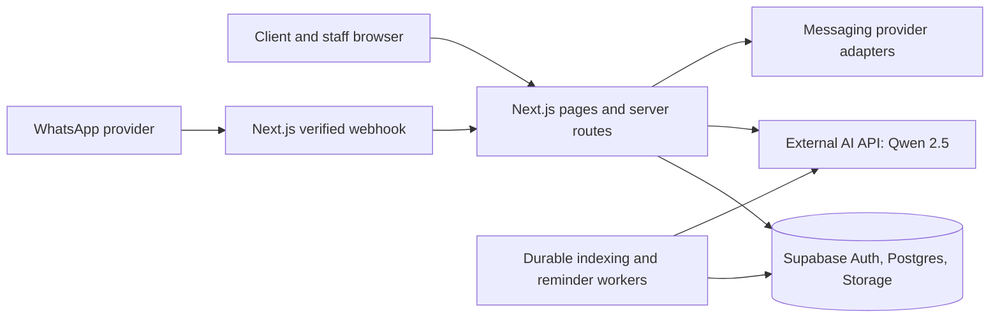

# Architecture and ownership

Next.js owns the product interface, authenticated API boundary, business workflows and provider adapters. Supabase owns identities, relational records, RLS and approved file objects. The external AI service owns Qwen inference and its model operations. Tebelopele's database remains the source of record for conversations, support assignments, content versions, consent and audit. Provider responses are persisted through the product API; the browser never calls the private AI or WhatsApp endpoint directly.

Use a browser Supabase client only for operations safely governed by RLS. Sensitive mutations and provider calls go through server routes that recheck the authenticated user and capability. Restrict service-role access to trusted server/worker processes with a small number of explicit operations. Use append-only event tables for audit, review, message delivery and support changes. Store original documents in private Supabase Storage and issue authorized, short-lived access.

For knowledge retrieval, approved versions are extracted and indexed by durable jobs. Permission filters run before keyword/vector ranking. The AI adapter receives only approved evidence needed for the answer and returns structured citations to validate against those source IDs. If the external system instead owns retrieval, its permission and citation contract must provide the same guarantees; that ownership must be decided before Phase 4.

WhatsApp and web use one canonical conversation/message/case model with a `channel` and provider IDs. A WhatsApp phone number alone is insufficient proof of client identity for sensitive data. Guided menus use stored flow versions and deterministic option IDs. A human takeover sets a conversation control state so automated responders cannot race an agent.

Initial release topology: one Next.js repository and one Supabase project per environment, plus the separately operated AI system and selected WhatsApp provider. UAT and production use separate credentials and databases. Hosting and data-processing regions require Tebelopele approval.
