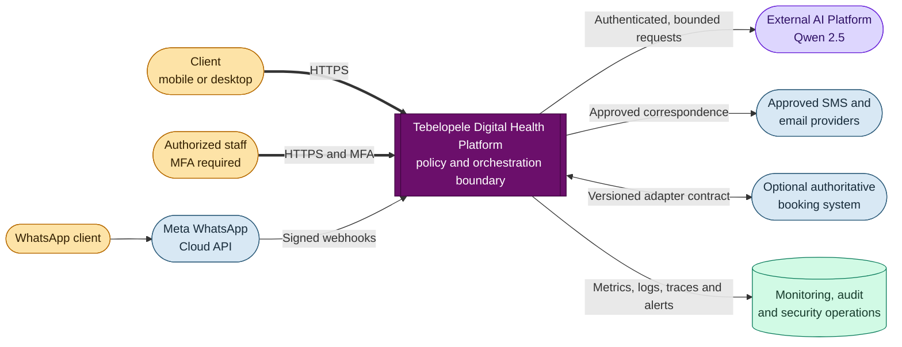
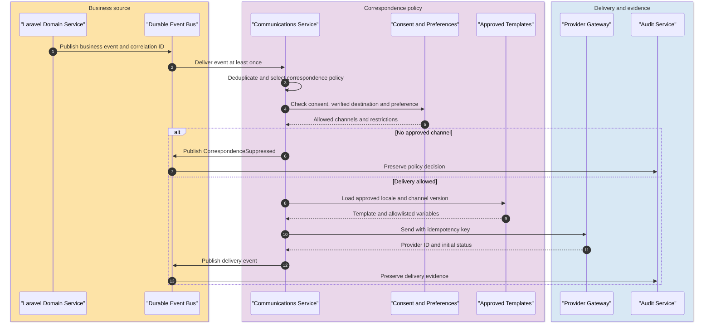
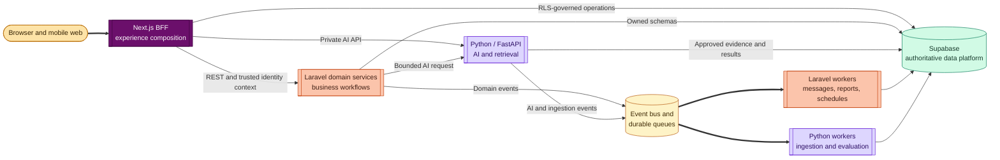
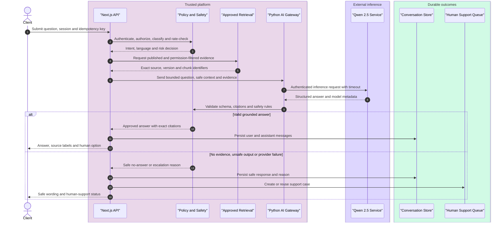
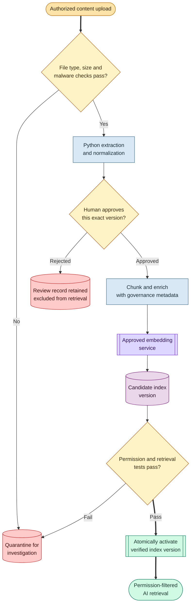
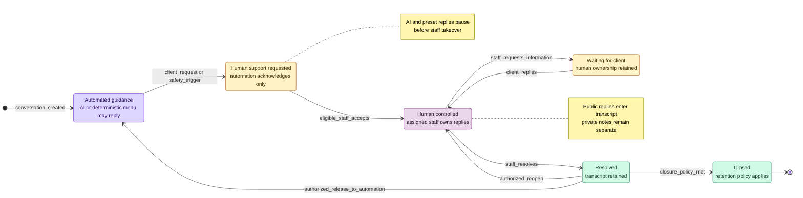
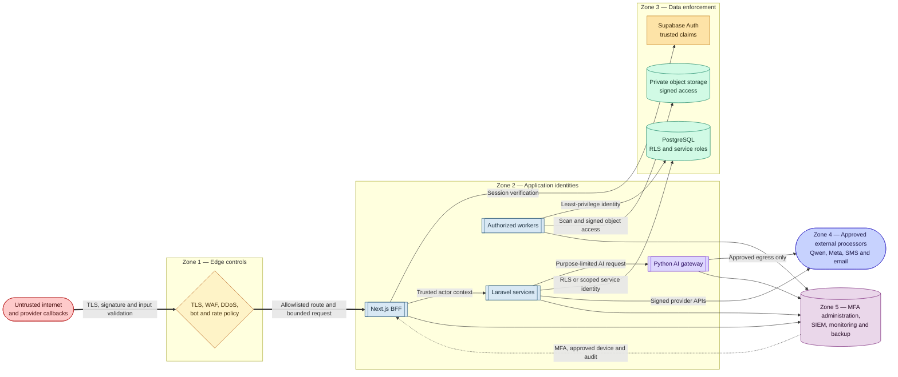
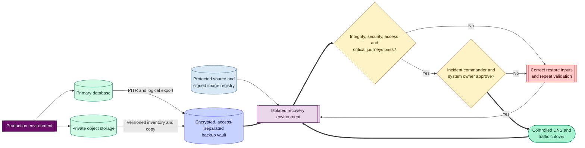

# Tebelopele AI-Enabled Digital Health and Client Engagement Platform

## Enterprise Solution Design Proposal

**Prepared for:** Tebelopele Wellness Centre  
**Document type:** Technical and solution-design proposal  
**Version:** 1.0  
**Date:** 6 October 2026  
**Classification:** Confidential — proposal and design baseline

---

## 1. Executive summary

Tebelopele Wellness Centre requires more than a public website or standalone chatbot. It requires a secure digital service platform that connects approved health information, client self-service, appointments, referrals, AI-assisted guidance, WhatsApp engagement and qualified human support without losing context between channels.

The proposed solution builds on the working Tebelopele platform already implemented with Next.js, Supabase and governed external integrations. It evolves that foundation into an enterprise architecture designed for horizontal scaling, controlled change, operational resilience, privacy, auditability and disaster recovery.

The design uses:

- Next.js and TypeScript for the public website, client portal, staff workspaces and trusted server-side application boundary.
- Python with FastAPI for the AI backend, retrieval, document-processing and model-evaluation workloads.
- Laravel for the supporting domain microservices, including IAM orchestration, communications, audit, comments/collaboration, appointments, referrals and reporting.
- Supabase PostgreSQL, Auth and Storage as the system of record for identities, permissions, operational records and governed content.
- Containerized application, integration and worker services using Docker to support repeatable delivery and infrastructure portability.
- A domain-aligned microservice architecture separating identity and access management, communications, auditing, collaboration, appointments, knowledge, conversations, referrals and reporting behind stable contracts.
- A managed edge, web application firewall and load-balancing layer to distribute traffic, terminate TLS, mitigate attacks and protect application endpoints.
- Distributed rate limiting, cache and job coordination to protect sensitive and expensive operations such as authentication, AI chat and provider webhooks.
- An external AI platform using Qwen 2.5 through a controlled AI gateway rather than exposing the model directly to browsers or channels.
- Retrieval-augmented generation grounded in approved, versioned Tebelopele content, with citation validation, safety controls and human escalation.
- A canonical conversation and support-case model spanning web and WhatsApp so clients do not need to repeat their story when a staff member takes over.
- Layered security combining identity, least privilege, row-level security, encryption, audit, secret management, supply-chain controls and continuous monitoring.
- Point-in-time database recovery, independent object-storage backup, configuration and source recovery, isolated restore rehearsals and documented incident response.

The architecture supports a phased progression from the current managed-cloud deployment to a highly available enterprise topology. It avoids premature complexity while preserving a clear route to multiple application instances, read scaling, queue-based processing, regional recovery and provider substitution.

### 1.1 Proposed business outcomes

- Provide clients with one consistent route to services across web, AI, WhatsApp and human support.
- Improve access to approved health and counselling information without allowing AI to present itself as a clinician.
- Reduce repetitive administrative work through guided journeys and automation.
- Route escalations to staff using verified skill, language, availability, facility and workload.
- Give staff a complete, permission-controlled transcript when they take over a conversation.
- Make content, AI answers, appointments, referrals and privileged activity auditable.
- Maintain service availability during demand spikes and recover predictably after faults or disasters.
- Create a modular integration layer so Tebelopele can replace providers without rebuilding the client experience.

---

## 2. Scope and solution boundaries

### 2.1 In scope

- Public Tebelopele website and service directory.
- Client identity, profile, preferences and versioned consent.
- Appointment request, scheduling, status and notification workflows.
- Approved health information, FAQs and governed knowledge management.
- AI-assisted web chat using Qwen 2.5 through an external service.
- WhatsApp guided journeys, notifications and human handover.
- Skill-based support routing, transcript continuity and staff takeover.
- Referral management and follow-up.
- Administrative, content, reporting and assurance workspaces.
- Role- and capability-based access control with Supabase row-level security.
- Audit, monitoring, rate limiting, backup, restoration and incident response.
- Docker-based packaging and enterprise deployment options.

### 2.2 Explicit boundaries

- The AI assistant provides approved information and service navigation; it does not diagnose, prescribe or replace clinical assessment.
- Supabase is the application system of record unless an approved existing clinical or booking system is identified as authoritative for a specific domain.
- Sensitive AI, WhatsApp and service-role credentials remain server-side.
- A WhatsApp phone number is not sufficient proof of identity for disclosure of private client information.
- General web search and ungrounded model responses are disabled by default and require explicit clinical, privacy and product approval.
- Final retention periods, clinical escalation rules, processing regions and production service levels require Tebelopele approval.

---

## 3. Current implementation baseline

The platform already provides a substantial working baseline:

- Branded, mobile-responsive public, client and staff experiences.
- Supabase authentication, profiles, roles, capabilities and row-level security.
- Client profiles, preferences and versioned consent.
- Appointment slots, bookings, status history and notifications.
- Governed health articles, FAQs, versions, review and publication workflows.
- AI conversation, message, citation, feedback and escalation structures.
- Human-support cases, skill-based eligibility, transcript continuity and internal notes.
- WhatsApp webhook adapter, guided menu state, signature validation and delivery records.
- Referrals, operational reporting and audit records.
- Nine user roles, five routing skills and an all-role demonstration superuser.
- Public interactive demonstration and floating AI/WhatsApp entry points.
- Git-based delivery, Supabase migrations and Vercel production deployment.

The following remain external or target-state dependencies rather than completed production capabilities:

- Final Qwen 2.5 endpoint, authentication, model variant and service-level contract.
- Completed Meta production phone registration, templates and live approval.
- Approved clinical safety wording and urgent-escalation rules.
- Final production retention schedule and data-processing-region approval.
- Verified enterprise load test, penetration test and disaster-recovery rehearsal.
- Production activation of distributed cache, durable queue and secondary recovery environment.

---

## 4. Architecture principles

1. **Human-centred continuity:** a client journey continues across website, chat, WhatsApp and staff takeover.
2. **Privacy by design:** collect the minimum necessary data and restrict it throughout its lifecycle.
3. **Approved knowledge first:** factual health answers are grounded in approved, current and permission-filtered sources.
4. **Zero implicit trust:** every request is authenticated, authorized and validated at the appropriate boundary.
5. **Defence in depth:** controls at edge, application, database, provider and operational levels must reinforce one another.
6. **Stateless horizontal scaling:** application instances do not depend on local sessions, files, locks or rate-limit counters.
7. **Asynchronous by default for slow work:** indexing, notifications, webhook processing and report generation use durable jobs.
8. **Idempotent integration:** retries must not duplicate messages, appointments, support cases or provider events.
9. **Observable operation:** every important request carries a correlation identifier across services.
10. **Graceful degradation:** provider failure must preserve the client request and offer a safe alternative.
11. **Portable deployment:** Docker images and infrastructure definitions provide a route between managed and self-hosted environments.
12. **Evidence-based release:** features are complete only when authorization, testing, monitoring, recovery and ownership are demonstrated.

---

## 5. System context architecture

The platform is the policy-enforcement and orchestration boundary. Browsers and WhatsApp never connect directly to private AI or administrative database credentials. External providers are treated as untrusted dependencies and accessed through validated, observable adapters.

---

## 6. Enterprise logical architecture

```mermaid
%% Runtime deployment: synchronous traffic scales independently from
%% asynchronous work, while all durable state remains outside containers.
flowchart LR
    channels(["Web, staff and<br>WhatsApp channels"]):::trigger

    subgraph edgeZone["Edge security and delivery"]
        direction TB
        dns["Managed DNS and CDN"] --> edgePolicy{"WAF, DDoS, bot and<br>rate-limit policy"} --> loadBalancer["Layer 7 load balancer<br>and TLS termination"]
    end

    subgraph executionPlane["Application execution"]
        direction TB
        nextPool[["Next.js replica pool<br>experience and BFF"]] --> serviceGateway[["Laravel and Python<br>service pools"]]
        serviceGateway -->|"Retryable work"| queue[("Durable queue and<br>dead-letter queue")]
        queue --> workers[["Independent worker pools"]]
    end

    subgraph sharedState["Shared state and controls"]
        direction TB
        operational[("Redis-compatible cache<br>limits and coordination")]
        data[("Supabase Auth, PostgreSQL<br>and private storage")]
        controls[("Managed secrets, signing keys,<br>telemetry and recovery vault")]
    end

    providers(["Qwen, Meta, SMS, email<br>and booking providers"]):::external

    channels ==> dns
    loadBalancer ==> nextPool
    executionPlane -->|"Governed state access"| sharedState
    executionPlane -->|"Authenticated egress"| providers

    classDef trigger fill:#fde3a7,stroke:#b66a00,color:#332000
    classDef edge fill:#ead7ea,stroke:#6b0f6b,color:#2b102b
    classDef compute fill:#d8e8f4,stroke:#315f7d,color:#172b3a
    classDef async fill:#fef3c7,stroke:#b45309,color:#3f2a05
    classDef state fill:#d1fae5,stroke:#047857,color:#173b2c
    classDef external fill:#ddd6fe,stroke:#6d28d9,color:#2e1065
    classDef assurance fill:#c7d2fe,stroke:#4338ca,color:#1e1b4b
    class dns,edgePolicy,loadBalancer edge
    class nextPool,serviceGateway compute
    class queue,workers async
    class operational,data,controls state
```

### 6.1 Recommended deployment strategy

The architecture supports two compatible production modes:

**Managed-cloud mode — recommended initial production:**

- Vercel provides edge delivery, application scaling, deployment isolation and the first WAF layer for Next.js.
- Supabase provides managed PostgreSQL, Auth and Storage.
- Docker packages the AI gateway, workers and scheduled jobs on a managed container platform.
- Managed Redis and a durable queue provide distributed coordination.

**Container-platform mode — portability and controlled-hosting option:**

- Next.js standalone output, gateway and workers are built as separate Docker images.
- A managed Kubernetes, container-app or equivalent platform runs a minimum of two application instances across failure domains.
- A managed Layer 7 load balancer performs health checks, TLS termination and rolling traffic shifts.
- A shared cache is mandatory for consistent multi-instance caching and cache-tag invalidation.
- All instances in a release use the same build identifier and Server Action encryption key.

The managed-cloud mode reduces operational burden for initial production. Container-platform mode is justified when data residency, network isolation, contractual control or sustained scale requires it. The application remains portable between the two because business state does not live inside the application container.

### 6.2 Domain-aligned microservice architecture

The enterprise target adopts a microservice approach organized around business capabilities rather than technical layers. Each service has a clear owner, contract, data boundary, deployment lifecycle and operational objective. Services communicate synchronously only where an immediate answer is required and publish durable domain events for downstream processing, correspondence, reporting and audit.

The existing Next.js application remains the web experience and backend-for-frontend. It does not become a shared database shortcut around the services. As capabilities mature, business logic is progressively extracted from the modular application into independently deployable Docker services using a controlled strangler pattern. This protects the current investment while avoiding the cost and risk of a single large migration.

```mermaid
%% Service landscape: requests are dispatched by domain while events converge
%% on communications, audit and reporting without point-to-point coupling.
flowchart LR
    channels(["Public, client, staff<br>and WhatsApp channels"]):::trigger
    edge{"Edge policy<br>and route protection"}:::decision
    bff[["Next.js experience and<br>backend-for-frontend"]]:::primary
    apiHub{{"Versioned service APIs<br>and trusted identity context"}}:::dispatcher

    engagement[["Engagement services<br>IAM, profiles, directory and appointments"]]:::service
    careFlow[["Guidance and care services<br>knowledge, AI, support and referrals"]]:::ai
    assurance[["Assurance services<br>comments, communications, audit and reporting"]]:::service

    events[("Durable domain-event bus<br>and job queues")]:::event
    data[("Service-owned schemas on<br>Supabase data platform")]:::data
    providers(["External provider gateway<br>Qwen, Meta, SMS and email"]):::external

    channels ==> edge ==> bff ==> apiHub
    apiHub --> engagement & careFlow & assurance
    engagement -->|"Domain events"| events
    careFlow -->|"Domain events"| events
    events ==>|"Correspondence, evidence and projections"| assurance
    engagement --> data
    careFlow --> data
    assurance --> data
    careFlow --> providers
    assurance --> providers

    classDef trigger fill:#fde3a7,stroke:#b66a00,color:#332000
    classDef decision fill:#fef3c7,stroke:#b45309,color:#3f2a05
    classDef primary fill:#6b0f6b,stroke:#3f063f,color:#ffffff
    classDef dispatcher fill:#ead7ea,stroke:#6b0f6b,color:#2b102b
    classDef service fill:#d8e8f4,stroke:#315f7d,color:#172b3a
    classDef ai fill:#ddd6fe,stroke:#6d28d9,color:#2e1065
    classDef event fill:#fef3c7,stroke:#b45309,color:#3f2a05
    classDef data fill:#d1fae5,stroke:#047857,color:#173b2c
    classDef external fill:#c7d2fe,stroke:#4338ca,color:#1e1b4b
```

### 6.3 Microservice capability catalogue

| Service | Primary responsibility | Representative capabilities and events |
| --- | --- | --- |
| IAM Service | Identity, authentication, authorization and account lifecycle | User registration/invitation, login policy, MFA, roles, capabilities, session revocation, application membership, access certification; emits `UserCreated`, `RoleAssigned`, `AccessRevoked` |
| Client and Staff Profile Service | Personal, professional and routing attributes | Client profile, preferences, staff number, job title, language, facility, availability, workload and verified skills; emits `ProfileUpdated`, `StaffAvailabilityChanged` |
| Service Directory Service | Public and internal service catalogue | Facilities, opening hours, services, outreach, publication state and discoverability; emits `ServicePublished`, `FacilityHoursChanged` |
| Appointment Service | Appointment lifecycle and availability | Slots, holds, booking, reschedule, cancellation, appointment status and staff notes; emits `AppointmentRequested`, `AppointmentConfirmed`, `AppointmentCancelled` |
| Knowledge and Content Service | Governed organisational knowledge | Articles, FAQs, source documents, immutable versions, review, publication, withdrawal and indexing jobs; emits `ContentApproved`, `ContentPublished`, `ContentWithdrawn` |
| Conversation and AI Orchestration Service | Canonical transcript and governed AI interaction | Conversations, messages, Qwen requests, retrieval, citations, safety policy, feedback and AI/human control state; emits `MessageReceived`, `AnswerGenerated`, `HumanSupportRequested` |
| Human Support and Routing Service | Skill-based case ownership and human takeover | Cases, eligibility, assignment, claim, reassignment, SLA, public replies, private notes and resolution; emits `CaseOpened`, `CaseAssigned`, `CaseResolved` |
| Communications Service | All outbound and in-app correspondence | Email, SMS, WhatsApp and in-app notification orchestration, template versions, consent/channel preference checks, scheduling, retries and delivery receipts; consumes business events and emits `NotificationQueued`, `MessageDelivered`, `DeliveryFailed` |
| Referral Service | Referral creation and follow-up | Referral route, responsible party, status, due date, follow-up, closure and outcome; emits `ReferralCreated`, `ReferralStatusChanged`, `ReferralOverdue` |
| Comments and Collaboration Service | Structured staff collaboration without altering source records | Contextual comments, mentions, review discussions, case collaboration, moderation, visibility scope and comment history; emits `CommentAdded`, `MentionCreated`, `CommentResolved` |
| Audit and Compliance Service | Tamper-evident security, business and activity audit | Sign-in activity, access decisions, privileged reads, data changes, role changes, publication, exports, Pulse/activity events, correlation and evidence retention; consumes events from every service and emits compliance alerts |
| Reporting and Analytics Service | Operational, management and assurance views | Permission-scoped metrics, read models, scheduled reports, exports, SLA trends and executive dashboards; consumes domain events and avoids analytical load on transactional services |
| External Integration Gateway | Isolation of external provider contracts | Qwen 2.5, Meta WhatsApp, email, SMS and booking adapters, provider authentication, circuit breakers, quotas, idempotency and normalized error contracts |

### 6.4 IAM Service

The IAM Service is the single policy authority for access to the Tebelopele platform. It uses Supabase Auth for identity primitives while owning Tebelopele-specific users, application memberships, roles, capabilities, account status and staff-access policy.

IAM responsibilities include:

- Create, invite, activate, suspend and disable user accounts.
- Enforce authentication policy and privileged-user MFA.
- Assign and revoke roles and capabilities through approved administration workflows.
- Resolve application membership when one email belongs to multiple approved applications.
- Issue the trusted authorization context used by services while preventing browser-supplied role claims from being trusted.
- Support facility, assignment, ownership and purpose restrictions in addition to coarse roles.
- Revoke sessions after account suspension, credential compromise or material role change.
- Publish access events to the Audit and Compliance Service.
- Produce periodic access-review evidence for managers and auditors.

Each domain service remains responsible for authorizing the requested action against its own resource. IAM answers who the actor is and which trusted grants they hold; it does not replace appointment ownership, support-case assignment or content-state rules.

### 6.5 Communications Service

The Communications Service is the central correspondence capability for SMS, email, WhatsApp and in-application notifications. Business services publish an event describing what occurred; the Communications Service decides whether, when and through which approved channel correspondence may be delivered.

Its responsibilities include:

- Maintain approved, versioned templates by event, channel, locale and audience.
- Check consent, communication preferences, verified destination and quiet-hour policy before sending.
- Render only allowlisted template variables and prevent sensitive data from entering an inappropriate channel.
- Select the correct provider adapter without exposing provider-specific logic to appointment, referral or support services.
- Queue immediate and scheduled correspondence such as appointment reminders and referral follow-ups.
- Apply provider quotas, rate limits, backoff, circuit breaking and idempotency.
- Record every delivery attempt, provider identifier, status and failure reason.
- Deliver in-app notifications into the client's protected notification centre.
- Receive delivery receipts and publish normalized delivery events.
- Provide an operator view for retrying or cancelling eligible failed correspondence.

### 6.6 Audit and Compliance Service

The Audit and Compliance Service receives security, administrative and business activity from all trusted services. It provides an independent, append-oriented evidence trail rather than relying only on application debug logs.

Audit categories include:

- Authentication attempts, session changes and MFA outcomes.
- Authorization decisions and denied access.
- User, role, capability and staff-skill changes.
- Sensitive or privileged record reads where policy requires them.
- Client profile, consent, appointment, referral and support-case changes.
- Content review, approval, publication and withdrawal.
- AI request policy decisions, model/prompt version, citation validation and escalation reason.
- Communications template selection, consent decision and delivery status.
- Data exports, administrative configuration and integration changes.
- Pulse and activity events used to establish service health, user activity and operational chronology.

Audit records include actor, subject, action, outcome, timestamp, service, environment, correlation ID, source IP/device risk where approved, target type/identifier and safe structured metadata. Sensitive message bodies and secrets are excluded unless a separately approved evidential requirement exists.

To strengthen evidential integrity, production audit data should use restricted append-only writes, separate read permissions, retention locks or cryptographic chaining where justified, independent export to the SIEM/archive, and alerts for ingestion gaps or attempted modification. The service supports authorized searches and evidence exports but does not grant administrators automatic access to private conversation contents.

### 6.7 Comments and Collaboration Service

The Comments and Collaboration Service allows authorized staff to discuss a content item, referral, support case, appointment exception or operational task without overwriting the domain record or mixing internal discussion with client-visible messages.

It provides:

- Context-bound comments linked by resource type and identifier.
- Public-to-team, restricted-team and named-participant visibility scopes.
- Mentions and in-app collaboration notifications.
- Comment resolution, edit history and moderation status.
- Clear separation between internal comments, clinical/source records and client-visible conversation messages.
- Permission checks delegated to the owning domain before a thread is opened or read.
- Audit events for comment creation, editing, deletion/redaction and restricted access.
- Retention and legal-hold behaviour aligned with the linked business record.

The reference to Pulse/activity auditing is implemented through events: collaboration and operational activity publish normalized events to the Audit and Compliance Service, which can build an authorized chronological pulse of system and user activity without giving the Comments Service ownership of audit evidence.

### 6.8 Service interaction and data-ownership rules

- A service owns its business rules and is the only service permitted to write its authoritative records.
- Other services use versioned APIs or consume published events; they do not update another service's tables directly.
- Supabase may initially host the physical tables in one managed PostgreSQL project, but logical ownership is enforced through schemas, database roles, grants and service identities.
- Distributed transactions are avoided. A local transaction commits business state and an outbox event atomically; workers publish the event to the bus.
- Consumers are idempotent because the queue provides at-least-once delivery.
- Events contain identifiers and minimum necessary attributes, not unrestricted snapshots of sensitive records.
- Synchronous calls use bounded timeouts, correlation IDs and circuit breakers.
- A service outage must not cascade: optional enrichment fails open only where safe; sensitive authorization fails closed.
- API and event contracts are versioned, tested and backward compatible through rolling deployments.
- Read models may combine events for reporting, but the underlying domain service remains authoritative.

### 6.9 Microservice deployment strategy

Microservices do not require one server per service on day one. The recommended progression is:

1. **Modular foundation:** preserve clear domain modules and database ownership inside the current platform.
2. **First extractions:** deploy Communications, Audit/Compliance and external integration workers independently because they have different scaling, security and failure characteristics.
3. **High-value domains:** extract AI/Conversation, Support Routing and Knowledge processing as demand and provider integration mature.
4. **Transactional domains:** extract Appointment and Referral services when independent release cadence, source-system integration or sustained load justifies it.
5. **Independent scaling:** assign service-specific autoscaling, SLOs, databases/schemas and operational ownership based on measured demand.

This approach gains the governance and resilience benefits of microservices without creating unnecessary network calls, duplicated infrastructure or operational burden before they are justified.

### 6.10 Polyglot technology strategy

The platform deliberately uses three complementary application frameworks. This is a controlled polyglot architecture, not unrestricted technology choice.

| Technology | Architectural role | Reason for selection |
| --- | --- | --- |
| Next.js and TypeScript | Public website, client portal, staff workspaces and backend-for-frontend | Strong server-rendered web experience, shared type-safe UI, responsive delivery and a secure boundary between browsers and internal services |
| Python and FastAPI | AI backend, retrieval, embeddings, document extraction, model evaluation and AI policy execution | Mature AI/data ecosystem, efficient model integration, asynchronous APIs, schema validation and natural fit for retrieval and evaluation pipelines |
| Laravel and PHP | Supporting business microservices and asynchronous operational workflows | Strong domain modelling, validation, authorization, events, queues, notifications, scheduling, testing and maintainable service APIs |
| Supabase | Managed PostgreSQL, Auth and private object storage | Transactional system of record, identity primitives, row-level security and managed data services |
| Redis-compatible service | Distributed cache, locks, quotas and rate limits | Shared coordination across Next.js, Python and Laravel replicas |
| Durable event bus/queue | Domain events, background jobs, retries and dead-letter handling | Decouples services and protects interactive requests from slow or unavailable downstream dependencies |

Technology ownership is explicit:

- Next.js owns presentation, navigation, user-session experience and response composition for web clients.
- Laravel owns business workflows and operational microservices that require strong transactional rules, correspondence, scheduled work and staff administration.
- Python owns AI-specific computation and policy-aware model orchestration; it does not become a second general business backend.
- Supabase remains the authoritative managed data platform, while service-specific database roles and schemas enforce ownership.
- No framework may bypass another service's business rules by writing directly to its owned records.

### 6.11 Python AI backend

The AI backend will be implemented in Python using FastAPI and packaged as one or more minimal Docker images. It provides a private, versioned API available only to the Next.js backend-for-frontend, authorized Laravel services and trusted workers.

The Python AI backend is responsible for:

- Qwen 2.5 provider integration and model-version routing.
- Prompt-template and AI-policy execution.
- Retrieval orchestration over approved, permission-filtered knowledge.
- Document extraction, normalization, chunking and embedding workflows.
- Hybrid retrieval, re-ranking and evidence assembly.
- Structured response generation and Pydantic schema validation.
- Citation verification against the supplied evidence set.
- Prompt-injection, unsafe-output and data-exfiltration checks.
- Language detection and approved multilingual processing.
- Conversation summarization under purpose and token limits.
- Offline evaluation, regression scoring and shadow/canary model comparison.
- Token, latency, safety, grounding and cost telemetry.

The AI backend is separated into bounded runtime roles:

| Python runtime | Responsibility | Scaling signal |
| --- | --- | --- |
| AI API | Low-latency chat, retrieval and structured answer endpoints | Request concurrency, p95 latency and CPU |
| Ingestion worker | Extraction, chunking, embedding and index preparation | Queue depth, oldest-job age and document size |
| Evaluation worker | Offline test suites, batch comparison and quality reports | Scheduled workload and evaluation-queue depth |
| Safety/policy worker | Optional asynchronous review, redaction and incident sampling | Policy queue depth and risk priority |

Each container runs a bounded process model. In an orchestrated environment, replication occurs through multiple containers behind the internal load balancer rather than relying on one oversized container. AI API instances remain stateless; conversation state, policy versions and results are persisted in authorized stores.

The FastAPI OpenAPI contract is generated but not publicly exposed in production. Service-to-service authentication, request signing or workload identity is required. Every request carries actor/application context, correlation ID, idempotency key, purpose, language and an explicit set of permitted evidence identifiers. The service rejects unrestricted instructions to search all content or retrieve private client data.

### 6.12 Laravel supporting microservices

Laravel is the standard framework for the non-AI supporting microservices. Each Laravel service is independently containerized and exposes a small versioned API plus domain-event consumers and producers.

Laravel services include:

- **IAM Service:** Tebelopele user lifecycle, roles, capabilities, application membership, access review and Supabase Auth orchestration.
- **Profile Service:** client preferences and staff operational/routing attributes.
- **Service Directory Service:** facilities, hours, service catalogue and outreach information.
- **Appointment Service:** slot and booking lifecycle, status history and appointment policies.
- **Knowledge Governance Service:** authoring, version review, approval, publication and indexing requests; Python performs extraction and retrieval processing.
- **Support Routing Service:** support cases, skill matching, claims, assignment, SLA and takeover state.
- **Communications Service:** SMS, email, WhatsApp and in-app correspondence, templates, preferences, delivery attempts and receipts.
- **Referral Service:** referral lifecycle, follow-up, status and outcomes.
- **Comments and Collaboration Service:** internal discussion, mentions, resolution and visibility rules.
- **Audit and Compliance Service:** immutable activity intake, evidence search, alert generation and retention controls.
- **Reporting and Analytics Service:** permission-scoped read models, dashboards, exports and scheduled reports.

Laravel framework capabilities are used consistently:

- Form Request or equivalent request validation at every API boundary.
- Policies and gates for service-level authorization, in addition to database RLS.
- Domain events and queued listeners for asynchronous reactions.
- Queue jobs for correspondence, exports, retries and integration processing.
- Scheduler-controlled recurring work with single-server/overlap protection in distributed deployments.
- Redis-backed rate limiting, locks and job coordination.
- Encrypted or protected queued payloads where sensitive metadata is unavoidable.
- Database transactions plus a transactional outbox for reliable event publication.
- Health, readiness and dependency endpoints for load balancers and orchestration.
- PHPUnit/Pest-style unit, feature, contract and authorization tests under the agreed engineering standard.

Laravel workers are deployed separately from Laravel HTTP API containers. This permits the Communications Service, for example, to scale provider-delivery workers based on queue depth without unnecessarily scaling its administrative API.

### 6.13 Cross-framework service standards

All Next.js, Python and Laravel services follow the same enterprise contract standards:

- OpenAPI 3.x for synchronous REST interfaces and AsyncAPI-style documentation for events.
- JSON with explicit schema versions, UTC ISO-8601 timestamps and stable error codes.
- OAuth/OIDC workload identity, signed service tokens or mTLS according to hosting capability.
- Correlation ID, causation ID and idempotency key propagated end to end.
- Standard health endpoints for liveness, readiness and dependency status.
- Consistent timeout, retry, circuit-breaker and bulkhead policies.
- Centralized structured logs with redaction rules shared across languages.
- OpenTelemetry-compatible traces and metrics.
- Semantic versioning and backward-compatible rolling changes.
- Consumer-driven contract tests before service deployment.
- Common privacy classifications and field-level logging restrictions.
- A shared event envelope containing event ID, type, version, source, subject, timestamp, correlation ID and classification.

---

## 7. Component design

| Component | Responsibility | Scale and resilience approach |
| --- | --- | --- |
| Edge/CDN | TLS, static delivery, traffic filtering and caching | Globally distributed managed service; origin shielding and health-aware routing |
| WAF | DDoS mitigation, bot filtering, IP rules and managed attack signatures | Rules deployed independently of application releases; alert on blocks and anomalies |
| Next.js application | User interfaces, session-aware server rendering, business APIs and authorization checks | Stateless replicas; rolling or blue/green deployment; no local durable state |
| AI/integration gateway | Stable contracts to Qwen, WhatsApp, SMS, email and booking systems | Timeouts, circuit breakers, idempotency, provider-specific adapters and fallback paths |
| Background workers | Indexing, notifications, webhook continuation, exports and retention jobs | Autoscale by queue depth; bounded concurrency; retry and dead-letter policies |
| Scheduler | Produces reminder, maintenance and retention jobs | Single logical scheduler using distributed lock or managed scheduling service |
| Redis-compatible service | Distributed rate limits, short-lived cache, locks and cache coordination | Managed highly available tier; never the sole store for business records |
| Durable queue | Separates request acknowledgement from slow or failure-prone work | At-least-once delivery with idempotent consumers and dead-letter queue |
| Supabase Auth | Identity, sessions and authentication lifecycle | Separate projects per environment; MFA policy for privileged staff |
| PostgreSQL | Authoritative transactional and audit data | Connection pooling, indexed queries, PITR and controlled read replicas |
| Object storage | Private knowledge documents and approved media | Versioning/retention policy, malware scanning and independent inventory/backup |
| Knowledge index | Permission-filtered retrieval over approved content | Rebuildable from source versions; blue/green index version activation |
| Observability platform | Metrics, logs, traces, alerting and dashboards | Centralized, access-controlled, retained independently of application containers |

---

## 8. Data architecture and governance

### 8.1 Authoritative domains

| Domain | System of record | Key controls |
| --- | --- | --- |
| Identity and roles | Supabase Auth plus `tebelopele_` authorization tables | MFA for privileged staff, account status, RBAC, RLS and audit |
| Client preferences and consent | Supabase PostgreSQL | Versioned consent, withdrawal history and purpose limitation |
| Services and facilities | Supabase or approved source-system adapter | Publication status, owner and review date |
| Appointments | Supabase unless an existing booking system is declared authoritative | Atomic slot allocation, idempotency and status history |
| Knowledge and FAQs | Versioned Tebelopele content repository | Draft/review/published states, exact source versions and restricted storage |
| Conversations and support | Canonical platform transcript and support-case tables | Channel identity, message provenance, human/AI control state and private-note separation |
| WhatsApp state | Platform flow and provider-event tables | Stable option IDs, webhook deduplication and identity-verification status |
| Referrals | Platform or approved clinical integration | Minimum necessary data, role scope and immutable event history |
| Audit and integration events | Append-oriented operational records | Restricted read access, integrity controls and retention schedule |

### 8.2 Data classification

| Class | Examples | Minimum protection |
| --- | --- | --- |
| Public | Published services, approved FAQs and facility hours | Integrity, publication approval and CDN-safe caching |
| Internal | Operational configuration and non-client reports | Authenticated staff access and audit where material |
| Confidential | Staff profiles, unpublished content and internal notes | Least privilege, encryption, restricted export and monitored access |
| Sensitive health-related | Client transcripts, referrals, consent and support context | Strong access control, purpose limitation, encryption, retention and privileged-read audit |
| Secret | Service-role keys, provider tokens and signing secrets | Managed secret vault, rotation, no logging and no browser exposure |

### 8.3 Database controls

- Every client-, facility-, content- or conversation-scoped table has explicit row-level security.
- Capability checks are derived from trusted database assignments, not browser-provided roles.
- Schema changes are additive, reviewed migrations executed through controlled CI/CD.
- High-write event tables use appropriate indexes, bounded payloads and partitioning when volume warrants it.
- Connection pooling prevents application autoscaling from exhausting PostgreSQL connections.
- Read replicas serve eligible reporting and catalogue workloads; security-sensitive and read-after-write journeys continue to use the primary.
- Audit events record actor, action, target, timestamp, correlation ID and safe metadata without duplicating unnecessary message bodies.
- Production data is never copied into development. Sanitized or synthetic data is used for testing.

---

## 9. AI architecture and governance

### 9.1 AI operating model

The AI capability is a governed service, not an unrestricted model embedded in the user interface. Qwen 2.5 is accessed only through the server-side AI gateway. The gateway owns authentication, policy checks, evidence selection, prompt templates, output validation, rate limiting, audit and provider failover behaviour.

The AI service supports four bounded modes:

1. **Deterministic journey:** known service, facility, appointment and FAQ intents are answered without model invention.
2. **Grounded knowledge answer:** retrieval supplies approved Tebelopele evidence and the model produces a cited explanation.
3. **Clarification or no-answer:** when evidence is insufficient, the system asks a bounded question or states that approved information is unavailable.
4. **Human escalation:** client request, urgent/sensitive triggers, low confidence or provider failure creates a support case with transcript continuity.

### 9.2 Governed retrieval and answer flow

### 9.3 Knowledge ingestion pipeline

### 9.4 Conversation automation and human-takeover states

The conversation control state prevents automated and human responders from racing one another. Every transition is persisted and audited; only an authorized action can return a human-controlled conversation to automation.

### 9.5 AI safety and quality controls

- Prompt and model versions are configuration-controlled and auditable.
- Only published, current and authorized content enters factual retrieval.
- Citation identifiers returned by the model are validated against evidence actually supplied.
- Full transcripts and direct identifiers are not sent to the external model unless explicitly required and approved.
- Input and output are checked for prompt injection, data-exfiltration attempts and prohibited content.
- Urgency decisions use approved deterministic rules and staff-reviewed wording; they are never model-only decisions.
- Model responses display source classification such as verified content, live data or no approved evidence.
- Evaluation sets cover Setswana/English behaviour, service navigation, health-content fidelity, refusal, escalation, citation precision and leakage.
- Model, embedding and prompt upgrades pass offline evaluation, shadow/canary testing and rollback gates.
- Cost and token budgets are enforced by user, route, provider and time window.
- Human feedback, escalation frequency, unsupported-answer rate and citation failures feed a controlled improvement process.

### 9.6 AI service-level controls

| Control | Proposed policy |
| --- | --- |
| Request timeout | Short bounded timeout with one safe retry only where idempotent |
| Circuit breaker | Open after sustained provider failure; stop repeated expensive calls |
| Fallback | Deterministic FAQs/services first, then human support; no silent switch to unapproved general AI |
| Context limit | Summarized and purpose-limited context; never blindly send the entire transcript |
| Logging | Correlation, latency, model/prompt version, token usage and source IDs; redact sensitive text from operational logs |
| Retention | Provider retention disabled or contractually minimized where available; final rule approved by Tebelopele |
| Availability | AI degradation must not take down public information, booking or human-support requests |

---

## 10. Omnichannel and WhatsApp architecture

Web and WhatsApp share a canonical conversation, message and support-case model. `channel`, provider identifiers and verified channel identity distinguish delivery while preserving one client journey.

### 10.1 WhatsApp processing pattern

1. Meta sends a signed webhook event.
2. The edge/WAF and webhook route enforce request size and route-specific rate limits.
3. The adapter validates the signature before parsing trusted fields.
4. Provider event ID is recorded under a unique constraint for deduplication.
5. The webhook returns quickly; durable processing continues through the queue.
6. A worker advances the versioned menu state or appends free text to the conversation.
7. Private branches check the approved identity-verification level.
8. AI is invoked only under the same knowledge and safety rules as web chat.
9. Human takeover changes the conversation control state and pauses automated replies.
10. Delivery receipts update the canonical message-delivery record.

### 10.2 Resilience controls

- Stable internal option IDs independent of displayed wording.
- Unique provider event and message identifiers.
- Idempotency keys for outbound messages and case creation.
- Ordered processing per conversation where order affects state.
- Retry with exponential backoff and randomized jitter.
- Dead-letter queue with operator replay after correction.
- Approved template versions and 24-hour-window handling.
- Text-menu fallback when rich list messages are unsupported.
- Clear client notification when the provider is delayed or human support is unavailable.

---

## 11. Security architecture

### 11.1 Security trust zones

### 11.2 Identity and access management

- Unique user identity with no shared production administrator accounts.
- MFA required for administrators, auditors, content publishers and staff with sensitive transcript access.
- Role-based capabilities supplemented by facility, assignment, ownership and purpose restrictions.
- Database RLS remains authoritative even when the user interface hides an action.
- Short-lived sessions, secure cookie settings, revocation and inactivity controls appropriate to role risk.
- Joiner, mover and leaver workflow with periodic access certification.
- Privileged access is time-bounded where practical and all role changes are audited.
- Superuser-style demonstration accounts are excluded from production or disabled before go-live.

### 11.3 Application and API security

- Server-side validation for every mutation using explicit schemas and bounded field sizes.
- CSRF protection through same-site session design and framework controls; origin checking for sensitive endpoints.
- Content Security Policy, HSTS, secure headers, clickjacking protection and restrictive cross-origin policy.
- Parameterized database access and safe output encoding.
- Upload allowlists, size limits, content sniffing, malware scanning and quarantine.
- SSRF protection through destination allowlists and blocked access to instance metadata/private networks.
- Webhook signature validation using the raw request body and constant-time comparison.
- Idempotency keys and replay windows for provider and financial/booking-style mutations.
- Generic external error messages while detailed diagnostics stay in protected logs.
- No secrets, service-role keys or private provider endpoints in browser bundles.

### 11.4 Infrastructure and supply-chain security

- Minimal, non-root Docker images with multi-stage builds and read-only runtime filesystem where supported.
- Pinned base-image digests and dependency lockfiles.
- Image, dependency, secret and infrastructure-as-code scanning in CI.
- Software bill of materials and signed build provenance for production images.
- Separate cloud projects/accounts and secrets for development, UAT and production.
- Managed secrets injected at runtime; rotation without source changes.
- Network egress restricted to approved provider destinations.
- Production database and administration interfaces are not exposed directly to the public internet beyond managed service endpoints and approved controls.

### 11.5 Security operations

- Centralized logs and security alerts with synchronized timestamps.
- Detection for repeated authentication failure, impossible access patterns, privilege changes, export spikes, webhook signature failures, excessive AI use and unusual transcript access.
- Incident severity matrix and on-call escalation.
- Vulnerability remediation targets based on severity and exploitability.
- Independent penetration test before production and after material architecture changes.
- Annual threat-model review and recovery exercise, with more frequent tabletop exercises.

---

## 12. Rate limiting and abuse protection

Rate limiting is layered. The edge blocks obvious floods before compute is consumed, while application-level distributed limits apply authenticated identity, operation cost and business context.

| Surface | Example starting limit | Key | Response and safeguard |
| --- | --- | --- | --- |
| Public read pages | 300 requests/minute | IP/device risk signal | CDN cache, then `429` for sustained abuse |
| Search | 60 requests/minute | IP plus session | Query-length limits and cached approved results |
| Sign-in | 5 attempts/15 minutes, progressive delay | Account plus IP | Generic response, alert and temporary challenge/lock policy |
| Password reset | 3 requests/hour | Account plus IP | Always return non-enumerating response |
| Authenticated general APIs | 120 requests/minute | User plus route | Distributed token bucket and `Retry-After` |
| AI chat | 10 requests/minute and daily budget | User/conversation/tenant | Queue/concurrency cap, token budget and human fallback |
| Human escalation | 3 new cases/hour | User/conversation | Reuse existing active case; prevent duplicate queue entries |
| File upload | 10 files/hour with size quota | User/role | Scan, quarantine and total-storage quota |
| WhatsApp webhook | Provider-aware burst limit | Provider/IP/app | Signature required; acknowledge duplicates safely |
| Outbound provider calls | Provider contract limit | Provider/operation | Queue, backoff, circuit breaker and dead-letter handling |
| Reports/exports | 5 jobs/hour | Staff user/role | Asynchronous generation, row/size cap and audit |

These are proposal defaults, not final production values. Load testing, provider quotas and expected Botswana usage patterns determine final thresholds. Accessibility and shared-network realities must be considered before relying heavily on IP-only limits.

---

## 13. Scalability and performance design

### 13.1 Scaling model

- Public assets and published pages are cached at the edge where safe.
- Authenticated and personalized responses are marked private and never shared through public caches.
- Application instances scale horizontally using CPU, request concurrency and latency signals.
- Worker pools scale independently using queue depth, oldest-job age and provider quotas.
- Redis-backed rate limits and coordination prevent each replica from enforcing a separate allowance.
- Database connection pooling protects PostgreSQL during rapid application scale-out.
- Read-heavy reporting and public catalogue queries may use replicas or precomputed views when consistency requirements permit.
- Expensive exports, content extraction and indexing never block an interactive request.
- Large content and media are delivered from object storage/CDN rather than application memory.
- Search and AI retrieval indexes are rebuildable, versioned and independently scalable.

### 13.2 Load-balancing behaviour

- Health endpoints separate liveness from readiness.
- Readiness fails when an instance cannot safely serve requests, preventing new traffic without killing in-flight work.
- Graceful shutdown drains active requests and stops claiming new jobs.
- Session affinity is not required because identity state is in signed sessions and shared services.
- Load balancers retry only safe/idempotent operations; mutations are not blindly replayed.
- Rolling deployments retain old instances until new instances are healthy.
- Blue/green or canary releases are used for high-risk application, AI-policy and integration changes.

### 13.3 Proposed non-functional targets

| Measure | Proposed production target |
| --- | --- |
| Monthly platform availability | 99.9% excluding approved maintenance and upstream provider exclusions |
| Public cached page latency | p95 under 1.5 seconds on representative Botswana mobile networks |
| Authenticated page/API latency | p95 under 2.5 seconds excluding declared external-provider operations |
| AI response | Streaming start or progress indication within 3 seconds; bounded total timeout |
| Webhook acknowledgement | p95 under 2 seconds, with slow work queued |
| Error rate | Under 1% for platform-controlled requests over a 15-minute window |
| Accessibility | WCAG 2.2 AA target across priority journeys |
| Horizontal scale | No application-session dependence on a specific replica |
| Capacity verification | Sustain at least 2× forecast peak with agreed latency/error targets |

Final service-level objectives will be derived from approved demand forecasts, provider contracts and budget.

---

## 14. Availability, backup and disaster recovery

### 14.1 Failure-domain strategy

- At least two healthy application replicas or a managed serverless platform capable of equivalent redundancy.
- Application and workers distributed across infrastructure failure domains where the hosting platform supports it.
- Database, cache, queue and secret stores use managed high-availability tiers.
- External provider outages are isolated through gateways and circuit breakers.
- Public approved information remains available even if AI is degraded.
- Booking, messaging or WhatsApp outages create recoverable queued work rather than silent loss.

### 14.2 Proposed recovery objectives

| Service/data class | Proposed RPO | Proposed RTO | Recovery approach |
| --- | ---: | ---: | --- |
| PostgreSQL transactional data | 15 minutes or better | 4 hours | PITR into isolated recovery project, validation, controlled cutover |
| Auth configuration and role model | 24 hours | 4 hours | Provider configuration export, migrations and controlled restoration |
| Private knowledge documents/media | 24 hours | 8 hours | Versioned object inventory plus independent encrypted copy |
| Application source and infrastructure definitions | Near zero after push | 2 hours | Git mirror, signed image registry and repeatable deployment |
| Queue jobs | 15 minutes | 4 hours | Durable queue replication/export where supported; reconstruct safe jobs from system of record |
| Knowledge/vector index | 24 hours | 8 hours | Rebuild from approved source versions and activate verified index |
| Observability/audit exports | 24 hours | 8 hours | Independent log destination and protected archive |

RPO is the maximum acceptable data-loss window; RTO is the target time to restore service. These values are recommended baselines and require business approval, plan selection and demonstrated rehearsal.

### 14.3 Backup design

- Enable Supabase Point-in-Time Recovery for the production database at the approved retention level.
- Keep scheduled logical schema/data exports for portability and selected long-term retention; encrypt them with keys separate from the source environment.
- Recognize that database backups do not automatically protect object-storage files; maintain a separate versioned object inventory and recovery copy.
- Back up configuration, approved templates, prompts, policy rules, migration history and environment-variable names without exporting live secret values into source control.
- Retain source in protected Git hosting with branch protection and an independent mirror.
- Retain immutable or write-protected backup copies according to the approved schedule.
- Monitor backup completion, age, size anomalies and restoration eligibility.
- Test deletion and corruption scenarios, not only total-environment loss.

### 14.4 Recovery architecture

### 14.5 Restore rehearsal

1. Select a declared recovery point and document the scenario.
2. Restore into an isolated non-production project; do not overwrite production during rehearsal.
3. Apply later migrations in order and restore approved configuration.
4. Validate row counts, referential integrity and orphan detection.
5. Validate object inventory and representative document access.
6. Test anonymous, client, staff, administrator and auditor permissions.
7. Execute representative service, appointment, AI fallback, escalation and reporting journeys.
8. Measure actual RPO and RTO and record exceptions.
9. Obtain business, privacy and technical sign-off.
10. Remove temporary credentials and destroy the rehearsal environment under change control.

### 14.6 Disaster and incident sequence

- **Detect:** monitoring identifies service, security, integrity or provider failure.
- **Declare:** incident commander assigns severity, owners and communication cadence.
- **Contain:** isolate the integration, credential, deployment or account without deleting evidence.
- **Preserve:** protect audit events, provider events, correlation IDs and relevant logs.
- **Recover:** roll back application, rotate credentials, replay safe jobs or restore to an isolated environment.
- **Validate:** security, data integrity and critical journeys pass before traffic resumes.
- **Communicate:** notify management, users, providers and authorities under approved legal/privacy procedures.
- **Learn:** complete a blameless review with corrective actions, owners and dates.

---

## 15. Observability and operational management

### 15.1 Telemetry

- Structured JSON logs with correlation ID, environment, service, route and safe outcome fields.
- Distributed traces across edge, Next.js, gateway, worker, database and provider calls.
- Golden signals: latency, traffic, errors and saturation.
- Business signals: appointment completion, escalation age, queue backlog, message-delivery success and referral follow-up.
- AI signals: grounded-answer rate, no-answer rate, citation validity, safety triggers, latency, token use and cost.
- Security signals: failed sign-ins, access denials, privilege changes, transcript reads, webhook failures and exports.

### 15.2 Alerts

Alerts must be actionable and mapped to an owner and runbook. Priority alerts include:

- Availability or error-budget burn.
- Database connection saturation, storage growth or replication lag.
- Queue age, retry storm or dead-letter growth.
- AI, WhatsApp or notification provider outage.
- Backup failure or backup age beyond threshold.
- Unusual authentication, privilege, export or transcript-access behaviour.
- Certificate, secret or provider-token expiry.
- Published content or index version approaching review expiry.

### 15.3 Operational dashboards

- Executive service health and adoption.
- Technical SLO and dependency health.
- Support queue, SLA age and routing effectiveness.
- Appointment and notification outcomes.
- Content publication and stale-source status.
- AI quality, safety and cost.
- Security and audit exceptions.
- Backup, restore and recovery readiness.

---

## 16. DevSecOps and release management

### 16.1 Environment strategy

| Environment | Purpose | Data policy |
| --- | --- | --- |
| Local development | Feature development and unit testing | Synthetic/local data only |
| Development/integration | Shared component and integration testing | Synthetic data and provider sandboxes |
| UAT | Tebelopele acceptance and operational rehearsal | Approved representative data; no uncontrolled production copy |
| Production | Live service | Controlled access, monitoring, backup and change approval |
| Recovery | Isolated restore and disaster rehearsal | Temporary restored data with tightly controlled access |

Each environment has separate Supabase projects, provider credentials, encryption material and callback URLs.

### 16.2 CI/CD quality gates

1. Branch protection and reviewed pull request.
2. Formatting, linting and TypeScript compilation.
3. Unit, integration and authorization regression tests.
4. Secret, dependency, source and container-image scanning.
5. Migration lint and disposable-database migration test.
6. Build reproducible Docker images with immutable identifiers.
7. Generate software bill of materials and sign release artifacts.
8. Deploy to preview/UAT and run browser, accessibility and API contract tests.
9. Run targeted AI evaluation for prompt/model/retrieval changes.
10. Require approval for production database, security, AI-policy and provider changes.
11. Deploy using rolling, canary or blue/green strategy.
12. Execute smoke tests, monitor health and retain one-action rollback.

### 16.3 Database release safety

- Expand/migrate/contract approach for breaking schema changes.
- Backward-compatible application and migration during rolling deployment.
- No destructive migration without verified backup, impact analysis and explicit approval.
- Long-running data backfills run as resumable jobs with progress metrics.
- Production migrations use a dedicated controlled identity, never a browser session.

### 16.4 Framework-specific delivery pipelines

The repository may remain a governed monorepo during the early microservice stages or move to separate repositories when independent teams and release cycles justify it. In either model, every service publishes an immutable Docker image and passes a common release policy.

| Stack | Required pipeline checks |
| --- | --- |
| Next.js/TypeScript | Locked dependency installation, lint, TypeScript compilation, unit/component tests, server/client boundary checks, browser tests, accessibility checks and production build |
| Python/FastAPI | Locked Python dependencies, formatting/lint, type checking, unit tests, API contract tests, AI evaluation suite, unsafe-prompt regression, dependency scan and container smoke test |
| Laravel/PHP | Locked Composer installation, code style/static analysis, unit/feature tests, authorization and queue tests, migration test, API/event contract tests and container smoke test |
| All containers | Minimal base image, non-root runtime, vulnerability scan, secret scan, SBOM, signed provenance, health-check verification and deployment-policy validation |

Database migrations are associated with the service that owns the affected domain. A Laravel or Python deployment cannot introduce unreviewed migrations against another service's schema. Cross-service changes use compatible staged contracts and migration sequencing.

---

## 17. Testing and assurance strategy

| Test area | Minimum evidence |
| --- | --- |
| Functional | Critical user journeys and negative/error paths |
| Authorization | Cross-user, cross-facility, role, assignment and RLS denial tests |
| Integration | Provider contract, timeout, retry, duplicate and outage tests |
| AI | Grounding, citations, refusal, escalation, injection, leakage and multilingual evaluation |
| Performance | Expected peak, 2× peak, spike, soak and database-pool tests |
| Resilience | Instance loss, provider outage, queue retry, cache loss and degraded dependency tests |
| Security | SAST, dependency/image scan, DAST, configuration review and independent penetration test |
| Accessibility | Automated checks plus keyboard, screen-reader and zoom testing of priority journeys |
| Backup/DR | Isolated restore with measured RPO/RTO and signed evidence |
| UAT | Role-based scripts approved by Tebelopele business and operational owners |

---

## 18. Enterprise delivery roadmap

### Stage 1 — Architecture and governance confirmation

- Confirm processing region, hosting model, service levels, retention and recovery objectives.
- Finalize clinical safety, identity verification and human-escalation rules.
- Approve external AI and WhatsApp contracts.
- Produce data-flow, threat-model and privacy-impact assessments.

**Gate:** signed solution design, decision log, data classification and responsibility matrix.

### Stage 2 — Production infrastructure foundation

- Create isolated environments and managed secret stores.
- Add Docker build pipeline for application portability, gateway and workers.
- Provision WAF, distributed rate limiting, cache, durable queue and monitoring.
- Establish backup policies and recovery project.

**Gate:** infrastructure security review, environment isolation test and restore smoke test.

### Stage 3 — Governed data and integrations

- Complete source-system adapters, webhook hardening and notification delivery.
- Implement malware scanning, ingestion workers and index-version controls.
- Finalize Meta registration and provider templates.

**Gate:** idempotency, provider outage and replay tests pass in UAT.

### Stage 4 — Qwen 2.5 production integration

- Finalize request/response and retention contract.
- Implement AI gateway, policy engine, retrieval filters and citation validation.
- Establish evaluation corpus and model/prompt release process.

**Gate:** clinical/product evaluation thresholds, privacy review and safe degradation approved.

### Stage 5 — Scale, security and resilience validation

- Execute load, spike and soak tests.
- Complete threat remediation and penetration test.
- Rehearse instance loss, provider outage and full database restoration.
- Train support, content, administration and incident-response teams.

**Gate:** performance, security, RPO/RTO and operational-readiness sign-off.

### Stage 6 — Controlled launch and stabilization

- Launch to a bounded pilot cohort.
- Observe SLOs, AI quality, support load and client feedback.
- Expand through controlled cohorts when acceptance thresholds hold.
- Complete post-launch review and prioritized optimization plan.

**Gate:** service owner approves general availability.

---

## 19. Responsibility model

| Area | Tebelopele | Delivery team | Cloud/provider |
| --- | --- | --- | --- |
| Clinical scope and safety wording | Accountable | Consulted/implements | Not responsible |
| Privacy, consent and retention approval | Accountable | Designs/implements controls | Contractual processor obligations |
| Product and service journeys | Accountable | Responsible for delivery | Consulted where provider constraints apply |
| Application security and testing | Informed/approves risk | Responsible | Platform-layer controls |
| Database and infrastructure operation | Governance/approval | Configuration and monitoring | Managed-service availability and backups per plan |
| AI model operation | Approves provider/use | Gateway, policy and evaluation | External AI inference service |
| WhatsApp approval and number ownership | Accountable | Adapter and workflow implementation | Meta/provider approval and delivery |
| Incident command | Accountable | Technical response | Provider escalation under contract |
| Recovery rehearsal | Participates and signs off | Executes and documents | Provides restore capabilities per plan |

---

## 20. Key risks and mitigations

| Risk | Impact | Mitigation |
| --- | --- | --- |
| AI provides unsupported health guidance | Client safety and trust | Approved retrieval, citation validation, deterministic safety rules and human escalation |
| Unauthorized transcript or client access | Privacy breach | RLS, assignment scope, least privilege, MFA and privileged-read audit |
| WhatsApp identity mistaken for verified client identity | Private-data disclosure | Explicit verification level and no sensitive disclosure before approved proof |
| Provider outage blocks client support | Service interruption | Circuit breaker, queue, deterministic content and human/alternative channel fallback |
| Traffic or bot spike drives outage/cost | Availability and cost | CDN/WAF, distributed rate limits, quotas, autoscaling and cost alerts |
| Application replicas serve inconsistent cached content | Stale or incorrect information | Shared cache/tag coordination, immutable build ID and controlled revalidation |
| Database restore exists but has never been tested | Extended outage | Scheduled isolated restore rehearsals with measured RPO/RTO |
| Storage documents omitted from database backup | Knowledge loss | Independent object inventory, versioned encrypted copy and restore test |
| Excessive Docker/orchestration complexity | Cost and operational risk | Managed services first; containerize bounded services and adopt orchestration only against measured need |
| Demo accounts persist into live operations | Unauthorized broad access | Go-live control to disable/remove demo identities and verify access roster |
| Slow mobile networks reduce adoption | Failed client journeys | Mobile-first design, small payloads, progressive enhancement and representative network testing |

---

## 21. Acceptance criteria for the enterprise solution

The target enterprise design will be considered operationally ready when:

- Two or more application instances can serve the same release without local session dependence.
- Load balancing, health checks, graceful drain and rolling rollback are demonstrated.
- Distributed rate limits protect authentication, AI, uploads, reports and provider endpoints.
- Every sensitive data path has authenticated, server-side authorization and negative RLS tests.
- A published content version can travel through upload, scan, review, indexing, retrieval and citation.
- Draft or restricted content cannot appear in an unauthorized AI response.
- Qwen outage produces a safe response, preserves the conversation and offers human support.
- A web or WhatsApp conversation can be escalated to an eligible staff member with transcript continuity.
- Duplicate webhooks and retries do not duplicate messages or cases.
- Load testing meets the approved peak and 2×-peak thresholds.
- Security review and independent penetration testing have no unresolved critical or high findings.
- Database and object-storage recovery are rehearsed in isolation and meet approved RPO/RTO.
- Monitoring detects failed jobs, provider failure, backup failure, privilege change and suspicious access.
- Tebelopele staff complete role-based UAT and operational training.
- Demo credentials are disabled, production access is certified and go-live is formally approved.

---

## 22. Decisions required before final production approval

1. Expected registered users, monthly active users, peak concurrent sessions and WhatsApp message volume.
2. Approved hosting and data-processing regions.
3. Final availability, RPO and RTO commitments and associated budget.
4. Final Qwen 2.5 model variant, endpoint, authentication, limits, retention and inference region.
5. Whether embeddings and retrieval are owned by Tebelopele or the external AI platform.
6. Meta business account, production number, templates and verification status.
7. Launch languages and approved translation/review workflow.
8. Clinical scope, urgent-risk wording, staffed hours and after-hours contacts.
9. Identity-verification rules for WhatsApp and other remote channels.
10. Record-specific retention, deletion, legal hold and audit-export requirements.
11. Existing appointment, client or clinical systems that remain authoritative.
12. Named service owner, data owner, security owner, clinical owner and incident commander.

---

## 23. Recommendation

Proceed with the managed-cloud enterprise topology as the initial production target: Vercel edge/application delivery, Supabase as the managed data platform, and Dockerized integration/AI gateway plus worker services on a managed container runtime. Add a highly available distributed cache, durable queue, centralized observability and tested independent recovery path.

This gives Tebelopele strong security and operational controls without taking on unnecessary Kubernetes-level complexity at launch. The Docker packaging, stateless design and documented contracts preserve a future migration path to a fully container-orchestrated environment if regulatory, scale or hosting requirements change.

The next architecture milestone should not be another interface feature. It should be a joint design-approval workshop covering data residency, Qwen/Meta contracts, clinical safety, demand forecasts and recovery objectives, followed by a production infrastructure and recovery proof of concept.

---

## 24. Reference standards and platform guidance

The detailed control set should be mapped during assurance to applicable Botswana legal requirements and Tebelopele policy. The technical design is informed by:

- OWASP Application Security Verification Standard and OWASP API Security guidance.
- NIST Cybersecurity Framework and incident-response principles.
- ISO/IEC 27001-aligned information-security management controls.
- ISO 22301-aligned business-continuity practices.
- WCAG 2.2 AA accessibility target.
- [Next.js self-hosting and multi-instance guidance](https://nextjs.org/docs/app/guides/self-hosting), including shared cache coordination, build identity and Server Action encryption consistency.
- [Supabase production checklist](https://supabase.com/docs/guides/deployment/going-into-prod), database backups and Point-in-Time Recovery guidance.
- [Supabase database overview](https://supabase.com/docs/guides/database/overview), including the important distinction that database backups do not include Storage objects.
- [Supabase read-replica guidance](https://supabase.com/docs/guides/platform/read-replicas) for eligible read scaling and resilience use cases.
- [Vercel Firewall guidance](https://vercel.com/docs/vercel-firewall) for managed DDoS, WAF, traffic monitoring and rate-limiting controls.
- [Docker production best practices](https://docs.docker.com/build/building/best-practices/) for small, reproducible and secure container images.
- [FastAPI container deployment guidance](https://fastapi.tiangolo.com/deployment/docker/) for Dockerized Python APIs and orchestrator-managed replication.
- [Laravel events](https://laravel.com/framework/docs/events), [task scheduling](https://laravel.com/framework/docs/scheduling) and [rate limiting](https://laravel.com/framework/docs/rate-limiting) for event-driven supporting services, controlled recurring work and distributed abuse protection.

---

## 25. Conclusion

The proposed solution creates a secure and scalable digital front door for Tebelopele. Its strength is not any single technology. It is the combination of governed content, defensible access control, accountable AI, omnichannel continuity, human ownership, observable operations and rehearsed recovery.

The architecture allows Tebelopele to launch pragmatically with managed services while retaining the controls and portability expected of an enterprise system. It protects the organization from model lock-in, provider failure and unchecked complexity, and it gives clients a clear route from information to service to qualified human support.
